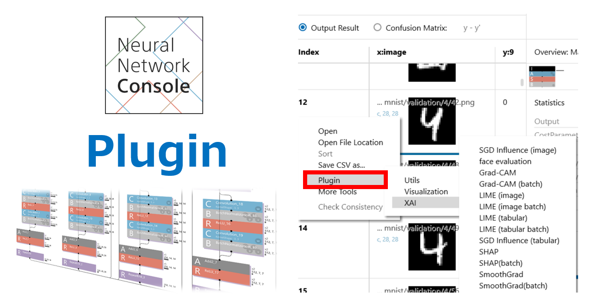
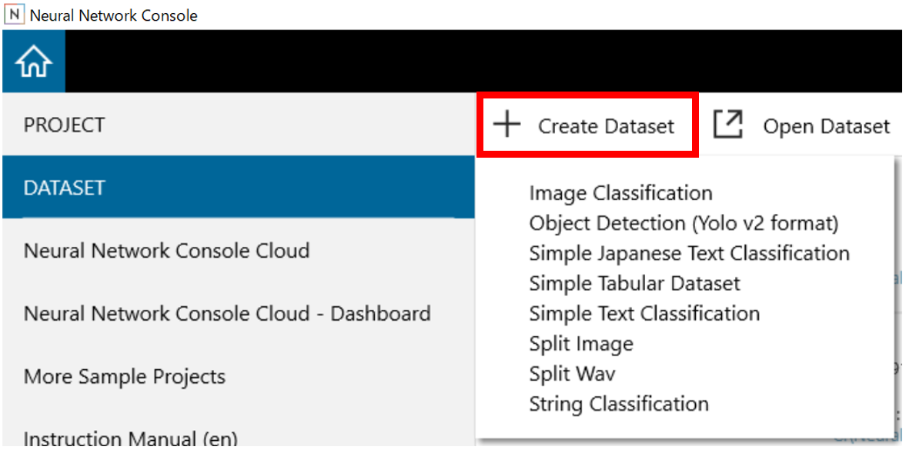
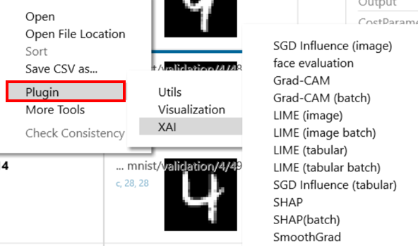

# Neural Network Console プラグイン \([English](README.md)/日本語\)

## Neural Network Console プラグインとは？
プラグインはNeural Network Console上で前処理と後処理の機能追加を行うための仕組みです。

Neural Network Consoleにプラグインが同梱されていますが、このリポジトリ
から最新版のプラグインを追加したり、プラグインのソースコードを参考にし
て独自のプラグインを開発することができます。

## プラグインリスト
###  Dataset
* 公平性
    * 公平性スコア
        * [Demographic Parity Difference](./manuals/ja/Dataset/Fairness/Evaluation/demographic_parity.rst)
        * [Disparate Impact](./manuals/ja/Dataset/Fairness/Evaluation/disparate_impact.rst)
    * 公平性アルゴリズム
        * [Reweighing](./manuals/ja/Dataset/Fairness/Bias_Mitigation/Reweighing.rst)

###  前処理プラグイン
* データセット作成
    * [Object detection (from Yolo v2 format)](./manuals/ja/Pre_Process/Create_Dataset/ObjectDetection.rst)
    * [Object detection (for CenterNet from Yolo v2 format)](./manuals/ja/Pre_Process/Create_Dataset/ObjectDetection_CenterNet.rst)
    * [Simple (Japanese) text classification](./manuals/ja/Pre_Process/Create_Dataset/SimpleTextClassification.rst)
    * [String classification](./manuals/ja/Pre_Process/Create_Dataset/StringClassification.rst)
    * [Simple tabular data](./manuals/ja/Pre_Process/Create_Dataset/SimpleTabularDataset.rst)
    * [Split image](./manuals/ja/Pre_Process/Create_Dataset/SplitImage.rst)
    * [Split wav](./manuals/ja/Pre_Process/Create_Dataset/SplitWav.rst)

###  後処理プラグイン
* ユーティリティ
    * [Cross tabulation](./manuals/ja/Post_Process/Utils/CrossTabulation.rst)
    * [CSV to wav](./manuals/ja/Post_Process/Utils/CSVtoWAV.rst)
    * [Inference](./manuals/ja/Post_Process/Utils/Inference.rst)
    * [Parameter stats](./manuals/ja/Post_Process/Utils/ParameterStats.rst)
    * [Restore split images / wav](./manuals/ja/Post_Process/Utils/RestoreSplitImageWav.rst)
    * [Similar words](./manuals/ja/Post_Process/Utils/SimilarWords.rst)
    * [Simple (Japanese) text generation](./manuals/ja/Post_Process/Utils/SimpleTextGeneration.rst)
    * [tSNE](./manuals/ja/Post_Process/Utils/tSNE.rst)
    
* 可視化
    * [Scatter plot](./manuals/ja/Post_Process/Visualization/ScatterPlot.rst)
    * [Tile images](./manuals/ja/Post_Process/Visualization/TileImages.rst)

* 説明可能なAI (XAI)
    * [Attention Editor](./manuals/ja/Post_Process/XAI/AttentionEditor.rst)
    * [SGD influence](./manuals/ja/Post_Process/XAI/SGDInfluence.rst)
    * [Influence Functions](./manuals/ja/Post_Process/XAI/InfluenceFunctions.rst)
    * [Grad-CAM](./manuals/ja/Post_Process/XAI/GradCAM.rst)
    * [LIME](./manuals/ja/Post_Process/XAI/LIME.rst)
    * [SHAP](./manuals/ja/Post_Process/XAI/SHAP.rst)
    * [Smooth Grad](./manuals/ja/Post_Process/XAI/SmoothGrad.rst)
    * [TracIn](./manuals/ja/Post_Process/XAI/TracIn.rst)
    * [RepresenterPoint](./manuals/ja/Post_Process/XAI/Representerpoint.rst)

* 公平性
<<<<<<< HEAD
    * 公平性スコア
        * [CV Score](./manuals/ja/Post_Process/Fairness/calders_verwer_score.rst)
        * [Demogrphic Parity](./manuals/ja/Post_Process/Fairness/demographic_parity.rst)
        * [Disparate Impact](./manuals/ja/Post_Process/Fairness/disparate_impact.rst)
        * [Equal Opportunity](./manuals/ja/Post_Process/Fairness/equal_opportunity.rst)
        * [Equalised Odds](./manuals/ja/Post_Process/Fairness/equalised_odd.rst)
        * [Theil Index](./manuals/ja/Post_Process/Fairness/theil_index.rst)
        * [Bias Amplification](./manuals/ja/Post_Process/Fairness/Evaluation/bias_amplification.rst) 
        * [KL Divergence](./manuals/ja/Post_Process/Fairness/Evaluation/kl_divergence.rst)
        * [Face evaluation](./manuals/ja/Post_Process/XAI/FaceEvaluation.rst)
=======
    * バイアス緩和
      * [Reject Option-Based Classification](./manuals/ja/Post_Process/Fairness/Bias_Mitgation/reject_option_based_classification.rst)
    * 公平性指標
       * [CV Score](./manuals/ja/Post_Process/Fairness/Evaluation/calders_verwer_score.rst)
       * [Demogrphic Parity](./manuals/ja/Post_Process/Fairness/Evaluation/demographic_parity.rst)
       * [Disparate Impact](./manuals/ja/Post_Process/Fairness/Evaluation/disparate_impact.rst)
       * [Equal Opportunity](./manuals/ja/Post_Process/Fairness/Evaluation/equal_opportunity.rst)
       * [Equalised Odds](./manuals/ja/Post_Process/Fairness/Evaluation/equalised_odd.rst)
       * [Theil Index](./manuals/ja/Post_Process/Fairness/Evaluation/theil_index.rst)
       * [Bias Amplification](./manuals/ja/Post_Process/Fairness/Evaluation/bias_amplification.rst)
       * [KL Divergence](./manuals/ja/Post_Process/Fairness/Evaluation/kl_divergence.rst)
       * [Face evaluation](./manuals/ja/Post_Process/Fairness/Evaluation/FaceEvaluation.rst)

>>>>>>> dcde71c (resolving conflicts)

## 最新のプラグインを利用するには

プラグインは、Neural Network Consoleで動作します。もしNeural Network Consoleをお持ちでない場合には、こちら(https://dl.sony.com/)からダウンロードしてください。

1. このリポジトリからzipファイルをダウンロードします。
2. PC上でzipファイルを解凍します。
3. 既存のプラグインフォルダを削除します。neural_network_console>libs>**plugins **.にあります。
* **注意**いくつかのプラグインをオフにしたくない場合は、そのままにしておいてください。

4. ダウンロードした**plugins**フォルダをneural_network_console>libs>**plugins **.の同じ場所に置きます。
5. Neural Network Consoleを再起動してください。

###  前処理プラグイン

* 前処理プラグインを実行するには、トップ画面左側の「DATASET」を選択し、「データセットの作成」をクリックします。そこで実行するプラグインを選択するこができます。

* To execute the plugins of the pre-processing, select the "DATASET" on the left of the top screen. Then  click "Create Dataset", you can select the plugins of the pre-processing.

  

### 後処理プラグイン

* 後処理プラグインを実行するには、 [評価] タブの評価結果を右クリックしてショートカットメニューを開き、実行するプラグインを選択します。

  

## サンプルプロジェクト
### 説明可能なAI (XAI)
* [Attention branch network](./samples/xai) resnet110-attention-branch-network.sdcproj
* [TracIn](./samples/xai) resnet56-tracin.sdcproj
* [RepresenterPoint](.\samples\xai\README.md) vgg16-representer-point.sdcproj

### 公平性
* [Prejudice Remover Regularizer](./samples/fairness/prejudice-remover-regularizer/README_ja.md) prejudice_remover_regularizer.sdcproj

### 最新のサンプルプロジェクトを利用するには

サンプルプロジェクトは、 Neural Network Consoleで動作します。
1. このリポジトリからzipファイルをダウンロードします。
2. PC上でzipファイルを解凍します。
3. ダウンロードした**サンプルプロジェクト**は、どこに置いても構いません。だだし、2バイト文字を含まないフォルダ名にしなければなりません。