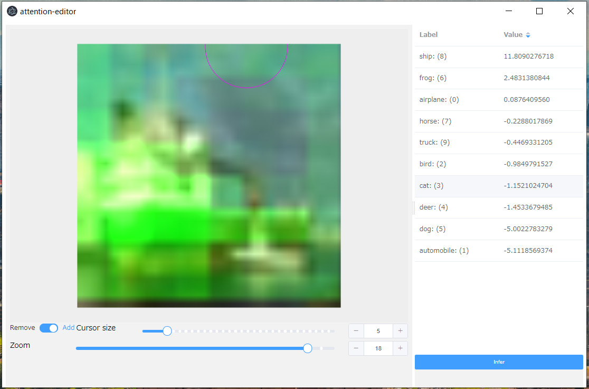

XAI/Attention Editor
~~~~~~~~~~~~~~~~~~~~

Interactively editing the Attention Map on the Attention Branch Network.
You can see how the inference results change.

You can try it easily with the `resnet -110 attention-branch-network.sdcproj` project
that included in NNC.

Left-click on the inference result image and select Plugin - XAI - Attention Editor (image) to launch the editor.
You can modify the Attention Map in the left pane and view the inference results in the right pane.

It has the following parameters, which you do not need to edit in `resnet -110 -attention-branch-network.sdcproj`

.. list-table::
   :widths: 30 70
   :class: longtable

   * - input-val
     - The CSV file used for evaluation is specified by default.
       It is only used to get the inference label.

   * - image
     - The image to edit the Attention Map is specified by default.

   * - model
     - Specifies the model to use for inference. By default, `results.nnp`
       is specified.

   * - map
     - Specifies the file name to save the edited map.

   * - attention-map-variable-name
     - The variable name to use as the attention map. The default is "Attention Map".

   * - input-name
     - The name of the input variable. The default is "x".

   * - output-name
     - The name of the output variable. The default is y '.

| Attention Branch Network:
| `Hiroshi Fukui, Tsubasa Hirakawa, Takayoshi Yamashita, Hironobu Fujiyoshi. "Attention Branch Network: Learning of Attention Mechanism for Visual Explanation". 2019 IEEE/CVF Conference on Computer Vision and Pattern Recognition (CVPR). <https://ieeexplore.ieee.org/document/8953929>`_
