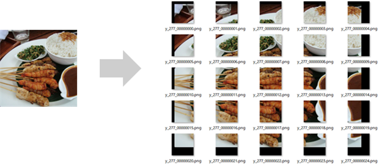
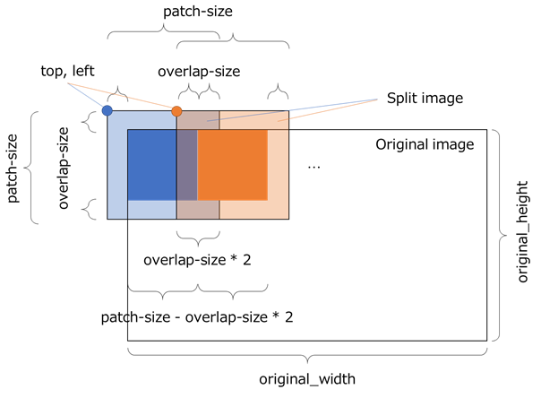

Split Image
~~~~~~~~~~~

Split the high-resolution image contained in the dataset CSV file into patch images smaller than the original image, and create a dataset CSV file with each patch as data. When the original high-resolution image cannot be processed by one neural network in the signal processing or segmentation task of the image, processing can be executed by split the image into patch images smaller than the original image using this plug-in.

.. list-table::
   :widths: 30 70
   :class: longtable

   * - input-csv
     - Specify the dataset CSV file to convert from

   * - input-variable1
     -
        Specify the variable name of the image to be split from the variables included in the dataset CSV file.
        
        To split multiple variables containing images of the same size into patch images, specify multiple variable names separated by commas.

   * - patch-size1
     - Specify the size of the image after splittubg in pixels

   * - overlap-size1
     - Specify the size to overlap with the next patch in pixels

   * -
        input-variable2
        
        patch-size2
        
        overlap-size2
     - These settings are used when one dataset CSV file contains multiple images to be split and image splitting is performed with settings different from the variables specified in input-variable1.

   * - output-dir
     - Specify the output folder for the converted dataset CSV file

   * - shuffle
     -
        Specify whether to shuffle each line of the converted dataset CSV file.
        
        true: shuffle randomly
        
        false: do not shuffle

   * -
        output_file1
        
        output_file2
     - Specify the name of the dataset CSV file to be created.

   * -
        ratio1
        
        ratio2
     -
        Set the ratio of the data used in the dataset CSV file to be created.
        
        The sum of the ratio1 and ratio2 must be 100 (%).
        
        If ratio2 is 0, all data will be output to output_file1.

This plug-in outputs the following variables required for image recomposition to the output dataset CSV file.

.. list-table::
   :widths: 30 70
   :class: longtable

   * - index
     - Index of data in the source dataset CSV file

   * - original_height
     - Height of source image (output for each variable)

   * - original_width
     - Width of source image (output for each variable)

   * - patch_size
     - Patch size (output for each variable)

   * - top, left
     - Upper left y, x coordinates of the patch in the source image (output for each variable)

**Reference**

Images split using this plug-in can be restored to the original high-resolution image with the Restore Split Image plug-in provided as a post-processing plug-in.

The size and aspect ratio of the images contained in the source dataset CSV file do not have to be the same.

When splitting an image, this plug-in pads the part of the output image that is not included in the original image with 0.

