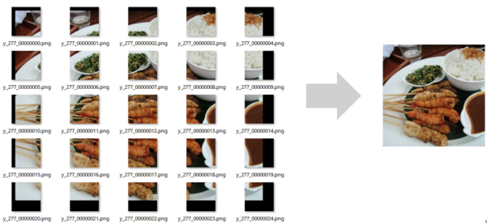

# Restore Split Image
Restores the original high resolution image from images split into multiple small patches for processing with a neural network. It can be used to restore high-resolution images from split images with the Split Image plug-in or the processing results.

# Restore Split Wav
Restores the original long Wav file from Wav files split into multiple small waveforms for processing with a neural network. It can be used to restore long Wav files from split Wav files with the Split Wav plug-in or the processing results.

## Reference
For each variable such as window-size, overlap-size and pos, please also refer to the explanation of the Split Wav plug-in.

