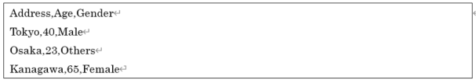

# Simple Tabular Dataset
Converts a CSV file of a tabular dataset consisting of the header in the first row and one data per row in the second and subsequent rows into the dataset CSV format in Neural Network Console. 

In the first row of tabular data, enter the name of each column.
In each cell of tabular data, enter a character string for category attributes and a number for numeric attributes. The following is an example of a CSV file for a tabular dataset with address and gender as categorical attributes and age as numeric attributes.

This plugin converts multiple explanatory variables contained in tabular data into one x vector. The categorical attribute explanatory variables are added as one hot vectors, and the numeric attribute explanatory variables are added to the vector elements as they are. Numerical attributes can be standardized by setting.

