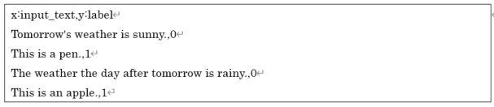
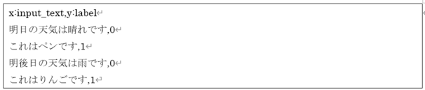

# Simple Text Classification
Converts to Neural Network Console dataset CSV file format based on a CSV file with the first column being an English string and the second column being a category index. The converted dataset CSV file will be the original English strings converted to the word index sequence and its length.

The CSV file input by this plugin has almost the same format as the dataset CSV file of Neural Network Console. The first line is the header, and the second and subsequent lines are the data. In the dataset CSV file, enter the English text as it is in each cell from the second row on the first column.

## Reference
The text classification dataset created using this plugin can be trained by using the 20newsgroups_classification sample project.
For training, set the Size property of Input layer to the value specified by max-length, set NumClass property of Embed layer to number of words determined by max-words or m in-occurences, set OutShape property of Affine layer to number of classification classes, respectively.

# Simple Japanese Text Classification
This is the Japanese version of Simple Text Classification.

Converts to Neural Network Console dataset CSV file format based on a CSV file with the first column being a Japanese string and the second column being a category index. The converted dataset CSV file will be the original Japanese strings converted to the word index sequence and its length.

The CSV file input by this plugin has almost the same format as the dataset CSV file of Neural Network Console. The first line is the header, and the second and subsequent lines are the data. In the dataset CSV file, enter the Japanese text as it is in each cell from the second row on the first column.

