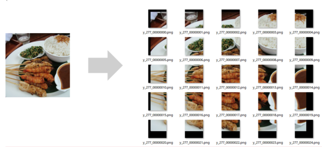
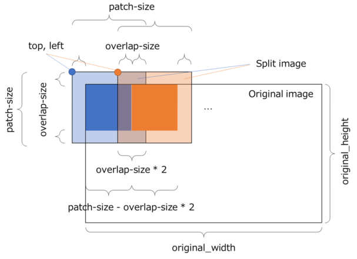

# Split Image
Split the high-resolution image contained in the dataset CSV file into patch images smaller than the original image, and create a dataset CSV file with each patch as data. When the original high-resolution image cannot be processed by one neural network in the signal processing or segmentation task of the image, processing can be executed by split the image into patch images smaller than the original image using this plug-in.

This plug-in outputs the following variables required for image recomposition to the output dataset CSV file.

## Reference
Images split using this plug-in can be restored to the original high-resolution image with the Restore Split Image plug-in provided as a post-processing plug-in.

The size and aspect ratio of the images contained in the source dataset CSV file do not have to be the same.

When splitting an image, this plug-in pads the part of the output image that is not included in the original image with 0.
