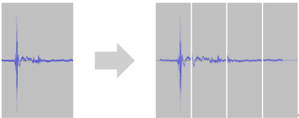
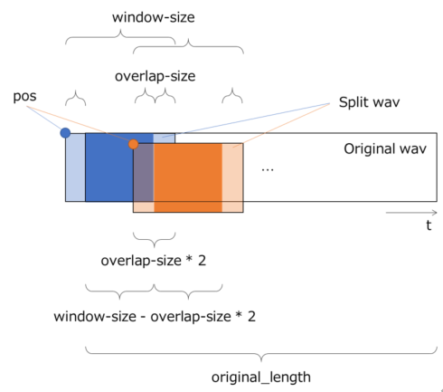

# Split Wav
Split the long Wav file contained in the dataset CSV file into small Wav files, and create a dataset CSV file with each small Wav file as data. When the original long Wav file cannot be processed by one neural network in the signal processing or segmentation task of the sound, processing can be executed by split the Wav file into small Wav files using this plug-in.

This plug-in outputs the following variables required for image recomposition to the output dataset CSV file.

## Reference
Wav file split using this plug-in can be restored to the original Wav file with the Restore Split Wav plug-in provided as a post-processing plug-in.

The lengths of the Wav files contained in the source dataset CSV file do not have to be the same.

When splitting the Wav file, this plug-in pads the range of the output Wav file that is not included in the original Wav file with 0. 

