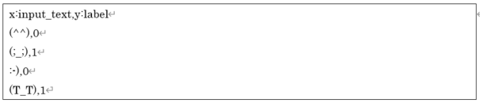

# String Classification
Converts to Neural Network Console dataset CSV file format based on a CSV file with the first column being a string and the second column being a category index. The Simple Text Classification plugin treats input sentences as word strings and indexes them word by word, while the String Classification plugin indexes characters by character, so it can be used for sentence classification that handles all languages.

The converted dataset CSV file will be the original strings converted to the character index sequence and its length.

The CSV file input by this plugin has almost the same format as the dataset CSV file of Neural Network Console. The first line is the header, and the second and subsequent lines are the data. In the dataset CSV file, enter the string as it is in each cell from the second row on the first column.

