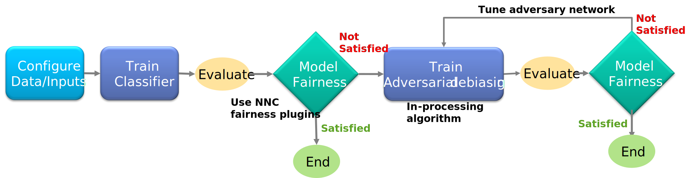

Fairness/Adversarial Debiasing (Tabular)
~~~~~~~~~~~~~~~~~~~~~~
Adversarial debiasing is an in-processing technique for bias mitigation in predictive models. In-processing techniques involve modification of learning algorithms to address discrimination during the model training phase.

Adversarial debiasing procedure takes inspiration from GANs (Goodfellow et al. 2014) for training a fair classifier. In GANs, a system of two neural networks is introduced. The two neural networks compete with each other to become more accurate in their predictions. Likewise, in adversarial debiasing, we build two models:

1. First model is a classifier which predicts target variable based on input features (training data).
2. Second model is an adversary and it tries to predict the sensitive attribute based on the predictions of the classifier model.

The Classifier and Adversarial networks are trained alternately with the objective of minimizing the loss of both the networks.

To execute this plug-in , specify both `Training` and `Validation` datasets in the DATASET tab, Specify `Epoch`, and `Batch Size` in the CONFIG tab with the below input information in plugin tab.

**Note : To use this plugin, there is no need to implement the `Classifier` and `Adversarial` networks separately in Neural Network Console. Internally this plugin will create a `Classifier` and `Adversarial` networks** 

`Zhang, Brian Hu, Blake Lemoine, and Margaret Mitchell. "Mitigating unwanted biases with adversarial learning." In Proceedings of the 2018 AAAI/ACM Conference on AI, Ethics, and Society, pp. 335-340. 2018. <https://arxiv.org/pdf/1801.07593.pdf>`_

Input Information
===================

.. list-table::
   :widths: 30 70
   :class: longtable
   :header-rows: 1

   * - Property
     - Notes

   * - mode
     - Mode is an option to choose the type of training mode. Two options are provided, one for `classifier` training and another for `adversarial_debiasing` training. `classifier` is default mode.

   * - lamda
     - Lamda is an adversarial loss parameter, use to tune the adversarial network. If the mode of training is `adversarial_debiasing`, please specify the adversarial loss (`lamda`) parameter.

   * - adv_epoch
     - Specify the number of epochs to train the adversarial network, Default value of `adv_epoch` is 100.

   * - privileged_variable
     - Specify the name of the column in the `Training` dataset CSV file to use as the privileged variable (Class in the protected attribute with the majority is called privileged class).

   * - unprivileged_variable
     - Specify the name of the column in the `Training` dataset CSV file to use as the unprivileged variable (Class in the protected attribute with minority is called unprivileged class).

