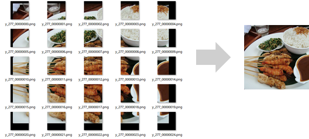
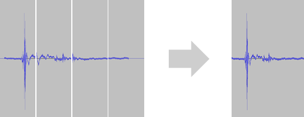

Utils/Restore Split Image
~~~~~~~~~~~~~~~~~~~~~~~~~

ニューラルネットワークを用いた処理のために複数の小さなパッチに分割された画像から、元の高解像度な画像を復元します。Split Imageプラグインで分割した画像、あるいはその処理結果から高解像度な画像を復元する際に利用することができます。

.. list-table::
   :widths: 30 70
   :class: longtable

   * - input-csv
     -
        画像の復元に用いるパッチ画像を含むデータセットCSVファイルを指定します
        
        ここで指定するデータセットCSVファイルには、以下の引数で指定する各種変数が含まれたものである必要があります

   * - image_index
     - データセットCSVファイルに含まれる変数のうち、復元先の画像のインデックスを示す変数を指定します

   * - input-variable
     - データセットCSVファイルに含まれる変数のうち、画像の復元に用いるパッチ画像を示す変数を指定します

   * - height-variable
     - データセットCSVファイルに含まれる変数のうち、復元先の画像の縦サイズを示す変数を指定します

   * - width-variable
     - データセットCSVファイルに含まれる変数のうち、復元先の画像の横サイズを示す変数を指定します

   * - patch-size-variable
     - データセットCSVファイルに含まれる変数のうち、パッチ画像の縦横サイズを示す変数を指定します

   * - overlap-size-variable
     - データセットCSVファイルに含まれる変数のうち、パッチ画像が隣り合うパッチと重複しているサイズを示す変数を指定します

   * - top-variable, left-variable
     - データセットCSVファイルに含まれる変数のうち、復元先の画像における左上座標のY座標、X座標を示す変数をそれぞれ指定します

   * - output-csv
     - 復元結果を出力するCSVファイルのファイル名を指定します

   * - inherit-cols
     - input-csvで指定する入力CSVファイルから、output-csvで指定する出力CSVファイルに引き継ぐ列を変数名で指定します

**ご参考**

patch-size、overlap-size、top、leftなどの各変数についてはSplit Imageプラグインの解説についても合わせてご参照ください。

Utils/Restore Split Wav
~~~~~~~~~~~~~~~~~~~~~~~

ニューラルネットワークを用いた処理のために小さく分割された複数の波形から、元の長い波形を復元します。Split Wavプラグインで分割した波形、あるいはその処理結果（WavファイルあるいはデータCSVファイル）から長い波形を復元する際に利用することができます。

.. list-table::
   :widths: 30 70
   :class: longtable

   * - input-csv
     -
        波形の復元に用いる細かく分割された波形を含むデータセットCSVファイルを指定します
        
        ここで指定するデータセットCSVファイルには、以下の引数で指定する各種変数が含まれたものである必要があります

   * - wav_index-variable
     - データセットCSVファイルに含まれる変数のうち、復元先の波形（WavファイルあるいはデータCSVファイル）のインデックスを示す変数を指定します

   * - input-variable
     - データセットCSVファイルに含まれる変数のうち、波形の復元に用いる分割された波形データを示す変数を指定します

   * - length-variable
     - データセットCSVファイルに含まれる変数のうち、復元先の波形の長さを示す変数を指定します

   * - window-size-variable
     - データセットCSVファイルに含まれる変数のうち、分割された波形の長さを示す変数を指定します

   * - overlap-size-variable
     - データセットCSVファイルに含まれる変数のうち、分割された波形が隣り合う波形と重複しているサイズを示す変数を指定します

   * - pos-variable
     - データセットCSVファイルに含まれる変数のうち、復元先の波形における位置を示す変数を指定します

   * - crossfade
     -
        crossfadeをチェックすることで、分割された波形が隣り合う波形と重複している個所について線形のクロスフェード処理を行います
        
        分割された波形のうちwindow-size – overlap-size \* 2の波形のみを用い結合を行うにはcrossfadeのチェックを外します

   * - default-sampling-freq
     -
        input-variableで指定した変数がデータCSVファイルである場合に用いる出力Wavファイルのサンプリング周波数を指定します
        
        input-variableで指定した変数がWavファイルである場合、出力Wavファイルのサンプリング周波数は読み込んだWavファイルのサンプリング周波数とおなじになります

   * - output-csv
     - 復元結果を出力するCSVファイルのファイル名を指定します

   * - inherit-cols
     - input-csvで指定する入力CSVファイルから、output-csvで指定する出力CSVファイルに引き継ぐ列を変数名で指定します

**ご参考**

window-size、overlap-size、posなどの各変数についてはSplit Wavプラグインの解説についても合わせてご参照ください。

