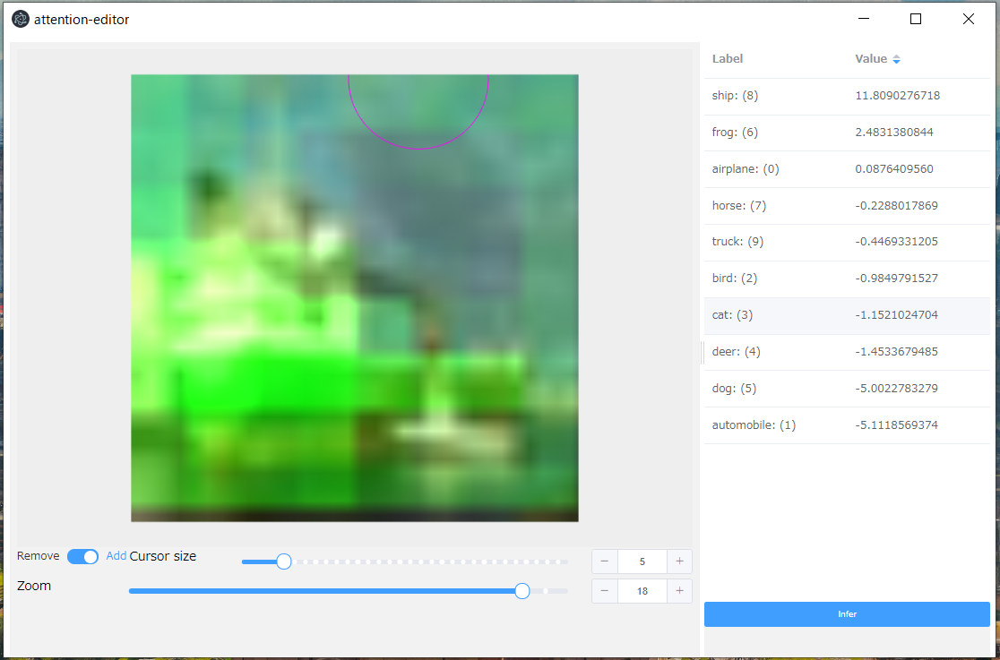

XAI/Attention Editor
~~~~~~~~~~~~~~~~~~~~

Attention Branch NetworkにおけるAttention Mapをインタラクティブに編集して
推論結果がどのように変化するのかを確認することができます。

NNCに同梱されている `resnet-110-attention-branch-network.sdcproj` プロジェクトにて簡単に試すことが可能です。

推論結果の画像を左クリックして、Plugin →XAs → Attention Editor(image)を選択するとエディタが起動します。
左側のペインでAttention Mapの修正を行い、右側のペインで推論結果を確認することができます。

以下のパラメータがありますが、 `resnet-110-attention-branch-network.sdcproj` では編集する必要はありません。

.. list-table::
   :widths: 30 70
   :class: longtable

   * - input-val
     - 評価時に用いたCSVファイルがデフォルトで指定されています。
       推論時のラベルを取得するためにのみ利用しています。

   * - image
     - Attention Mapを編集する画像がデフォルトで指定されています。

   * - model
     - 推論に利用するモデルを指定します。デフォルトで `results.nnp` 
       が指定されています。

   * - map
     - 編集したmapを保存するファイル名を指定します。

   * - attention-map-variable-name
     - Attention mapとして用いるvariable名を指定します。デフォルトは「Attention Map」です。

   * - input-name
     - 入力variableの名前です。デフォルトは「x」です。

   * - output-name
     - 出力variableの名前です。デフォルトは「y'」です。

| Attention Branch Network:
| `Hiroshi Fukui, Tsubasa Hirakawa, Takayoshi Yamashita, Hironobu Fujiyoshi. "Attention Branch Network: Learning of Attention Mechanism for Visual Explanation". 2019 IEEE/CVF Conference on Computer Vision and Pattern Recognition (CVPR). <https://ieeexplore.ieee.org/document/8953929>`_
