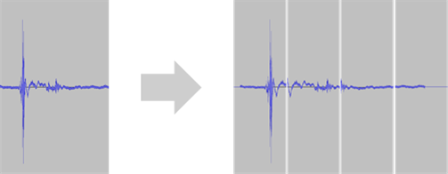
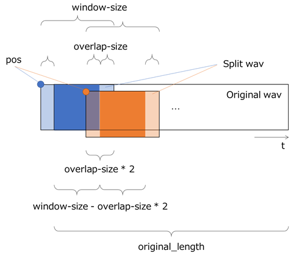

Split Wav
~~~~~~~~~

データセットCSVファイルに含まれる長い波形を元の波形よりも小さな波形に分割し、分割後の各波形をデータとするデータセットCSVファイルを作成します。波形の信号処理やセグメンテーションタスクにおいて元の長い波形が1つのニューラルネットワークで処理しきれないような場合にも、本プラグインを用いて波形を元の波形より小さい波形に分割することで処理の実行が可能になります。

.. list-table::
   :widths: 30 70
   :class: longtable

   * - input-csv
     - 変換元のデータセットCSVファイルを指定します

   * - input-variable1
     -
        データセットCSVファイルに含まれる変数のうち、分割対象の波形の変数名を指定します
        
        同じサイズの波形を含む複数の変数を分割する場合は、カンマ区切りで複数の変数名を指定します

   * - window-size1
     - 分割先の波形のサイズをサンプル単位で指定します

   * - overlap-size1
     - 隣の波形と重複させるサイズをサンプル単位で指定します

   * -
        input-variable2
        
        window-size2
        
        overlap-size2
     - 1つのデータセットCSVファイルに分割対象の波形が複数含まれ、かつinput-variable1で指定した変数とは異なる設定値での波形分割を行う場合に使用します

   * - output-dir
     - コンバート後のデータセットCSVファイルの出力フォルダを指定します

   * - shuffle
     -
        コンバート後のデータセットCSVファイルの各行のシャッフルを実施するかどうかを指定します
        
        true : ランダムにシャッフルを行います
        
        false : シャッフルを行いません

   * -
        output_file1
        
        output_file2
     - コンバート後のデータセットCSVファイル1,2のファイル名を指定します

   * -
        ratio1
        
        ratio2
     -
        コンバート後のデータセットCSVファイル1,2に用いるデータの割合を指定します
        
        ratio1, ratio2の割合の合計は100 (%)である必要があります
        
        ratio2が0である場合、output_file1にすべてのデータが出力されます

本プラグインは、出力データセットCSVファイルに波形の再合成に必要な以下の変数を出力します。

.. list-table::
   :widths: 30 70
   :class: longtable

   * - index
     - 変換元データセットCSVファイルにおけるデータのインデックス

   * - original_length
     - 分割前の波形の長さ（変数毎に出力）

   * - window_size
     - 分割後の波形のサイズ（変数毎に出力）

   * - pos
     - 分割前の波形における分割後の波形の位置（変数毎に出力）

本プラグインを用いて分割した波形は、後処理プラグインとして用意されているRestore Split Wavプラグインで元の波形に復元することができます。

**ご参考**

変換元データセットCSVファイルに含まれる波形の長さは統一されている必要はありません。

本プラグインは波形分割時、出力波形のうち元波形に含まれない範囲を0でパディングします。

