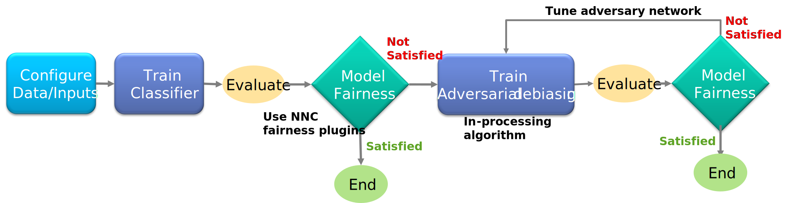

Fairness/Adversarial Debiasing (Tabular)
~~~~~~~~~~~~~~~~~~~~~~

Adversarial debiasingは学習中にモデルのバイアスを抑制する手法です．
学習中にバイアスを抑制する手法のため，学習アルゴリズムの変更が含まれます．

Adversarial debiasingはGAN(Goodfellow et al. 2014)のアイデアを元に公平な分類器を学習します．
GANでは2つのニューラルネットワークが用いられます．
2つのニューラルネットワークが互いに抑制しあい競合することで精度を高めます．
Adversarial debiasingも同様で，下記のような2つのニューラルネットワークを構築します．

1. 1番目のモデルでは学習データからターゲットのラベルを予測する分類器です．
2. 2番目のモデルは，敵対的に1番目のモデルの予測からセンシティブ属性を予測する分類器です．

上記両方のネットワークがお互いの損失を最小にすることを目的として，交互にネットワークを学習します．

このプラグインを実行するには， `データセット` タブで `Training` と `Validation` の両方のデータセットを指定し， `コンフィグ` タブで `学習反復世代数` と `バッチ サイズ` を指定し， `プラグイン` タブで下記のInput Informationを入力します。

**注 : このプラグインを使用するために，Neural Network Console で `Classifier` ネットワークと `Adversarial ` ネットワークを別々に実装する必要はありません．内部的にこのプラグインは， `Classifier` と `Adversarial` ネットワークを作成します**

`Zhang, Brian Hu, Blake Lemoine, and Margaret Mitchell. "Mitigating unwanted biases with adversarial learning." In Proceedings of the 2018 AAAI/ACM Conference on AI, Ethics, and Society, pp. 335-340. 2018. <https://arxiv.org/pdf/1801.07593.pdf>`_

Input Information
===================

.. list-table::
   :widths: 30 70
   :class: longtable
   :header-rows: 1

   * - Property
     - Notes

   * - mode
     - modeは学習モードの種類を選択するオプションです．2つのオプションがあり，1つ目は `classifier` 学習用で，2つ目は `adversarial_debiasing` 学習用です． デフォルトでは `classifier` モードです．

   * - lamda
     - lamdaは敵対的損失パラメータであり，敵対的ネットワークの調整に利用します．トレーニングのモードが `adversarial_debiasing` の場合，このパラメータを指定してください． 

   * - adv_epoch
     - 敵対的ネットワークをトレーニングするためのエポック数を指定します． `adv_epoch` のデフォルト値は 100 です．

   * - privileged_variable
     - `Training` データセットCSVファイルから，'privileged'属性として使用する列名を指定します．(バイアスが現れる可能性のある属性において多数派は'privileged'クラスと呼ばれます．)

   * - unprivileged_variable
     - `Training` データセットCSVファイルから，'unprivileged'属性として使用する列名を指定します． (バイアスが現れる可能性のある属性において少数派は'unprivileged'クラスと呼ばれます．)
