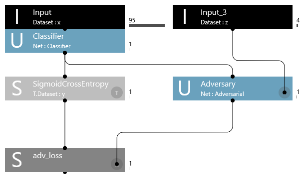
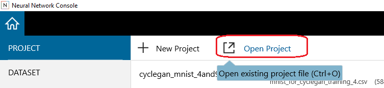
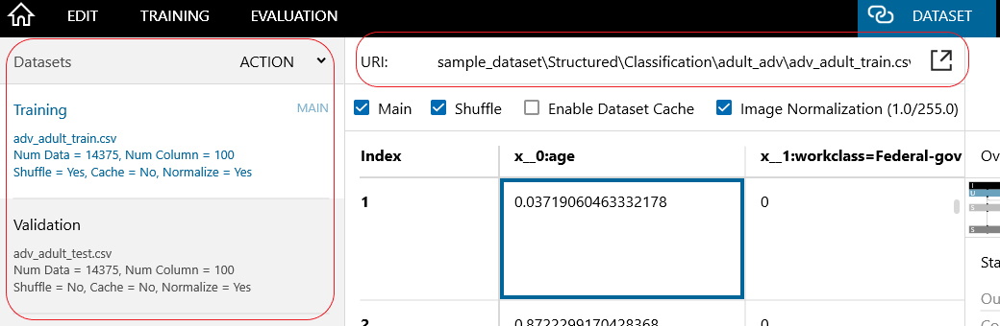
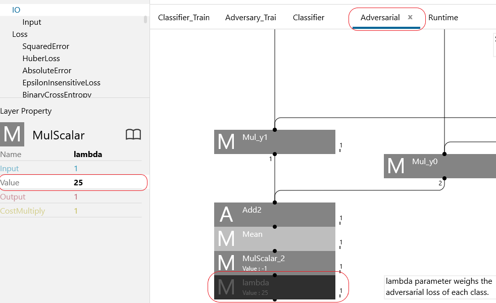
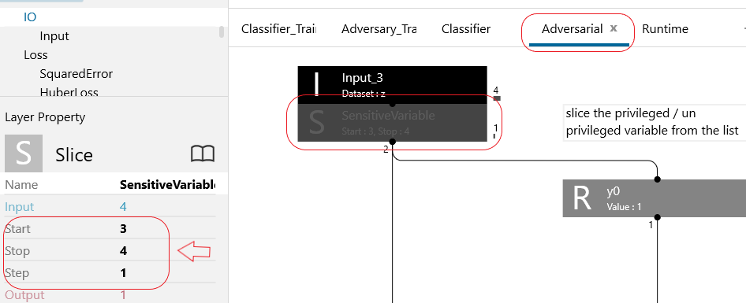
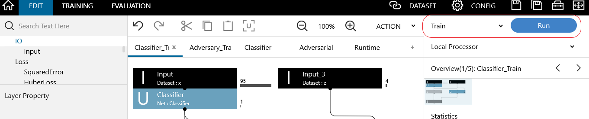
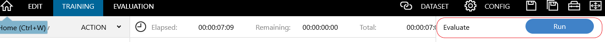
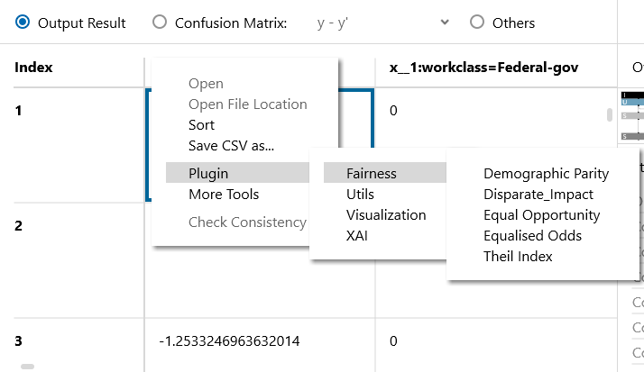

# Adversarial Debiasing (Tabular)

This is a `Neural Network Console` demo of the `Adversarial Debiasing` technique to reduce bias in `UCI Adult dataset`.

Figure: NNC training daigram of Adversarial debiasing

In this demo, we show how to mitigate bias in a predictive model with `Adversarial Debiasing` in-processing technique. Adversarial Debiasing procedure takes inspiration from [GANs](https://arxiv.org/abs/1406.2661) (Goodfellow et al. 2014) for training a fair classifier. Similar to GANs, there are two networks in Adversarial Debiasing:

1. A `Classifier` network which predicts the target variable based on input features (training data).
2. An `Adversarial` network which tries to predict sensitive attribute based on the predictions of the `Classifier` network.

`Classifier` and `Adversarial` networks are trained alternately with the objective of minimizing the loss of both the networks.

To train the Adversarial Debiasing model in NNC, please follow the below steps :
### Step 1 : Start Neural Network console
`Double-click` "neural_network_console.exe" to run it.

### Step 2: Open the Adversarial Debiasing project

Click `Open Project`, or press `Ctrl+O` on the keyboard. From the list of the (*.sdcproj files), select the `adversarial_debiasing.sdcproj` and open it.

Figure: Open project file

When "Adversarial Debiasing" project is opened for the first time, it will redirect and open a 'pop-up' window, asking to download the preprocessed adult dataset to run the project. Please provide the ​output​ directory, where you want to download and preprocess the data automatically, and then click `OK`. Typically, it takes a few minutes for dataset preparation to complete.

The adult dataset(`adult.data`) used in the Adversarial debiasing project is downloaded from the following website: [https://archive.ics.uci.edu/ml/datasets/Adult](https://archive.ics.uci.edu/ml/datasets/Adult).

If downloading of the dataset fails, it could be proxy issue. Kindly refer to NNC manual. 

### Step 3: Process the Dataset
In the `Dataset` tab, confirm that adult training and validation datasets (samples of adult dataset, which is preprocessed) are extracted and saved.

Please assign the `adv_adult_train.csv` file to `Training` set `adv_adult_test.csv` file to `Validation` set.

Note : 
Preprocessing parameters are created based on the input CSV file (`preprocessing_parameters.csv`).

Figure: Data configuration

### Step 4: View the contents of the Adversarial Debiasing  project
In the `EDIT` tab, confirm if "Classifier & Adversarial" training network is loaded, for performing fair classification on UCI Adult dataset.

### Step 5: Tune the adversarial loss parmeter lambda (&lambda;)

Go to the `Adversarial` network, tune the adverasarial loss  parmeter lambda (&lambda;) (`lambda`, end node of the `Adversarial` network). If `lambda` is 0, the network behaves as a simple base class classifier network. After tuning(&lambda;) the Adversarial network, please save the project.

Figure: Tune lambda (&lambda;)

### Step 6: Configure the senstive variable

To train the Adversarial network, specify the privileged variable from sensitive variables dataset.
Go to the `Adversarial` network, and configure the `SensitiveVarible` in the neural network by specifying the `start` and `stop` points of the variables from the sensitive variables dataset.by default race "white" is set as a privileged variable in the neural network console.

Figure: Configure 

### Step 7: Train Classfier model with Adversarial network
In the `Edit` tab, Select the `Train` from the training combo box and click the `Run` button to start the training procedure.

Figure: NNC training

### Step 8: Execute evaluation
Once the Training successfully completes, the evaluation button will be enabled. Go to the `TRAINING` tab, and click the Evaluate `Run` button to start the evaluation process on the validation dataset.

Figure: NNC Evaluate

### Step 9: Check model Fairness & Accuracy
To check the model fairness, execute the `Fairness` plugins(right-click the evaluation results on the evaluation tab to open a shortcut menu and select the plugins) by configuring the privileged and unprivileged variables. Execute all the fairness plugins and check the model fairness before and after adversarial training.

Figure: Fairness plugin

To check the accuracy of the model, Go to the `Evaluation` tab click on `Confusion Matrix`, and check Accuracy, Average Precision, Average Recall, etc.

For more information about this technique, please refer to our Google Colab tutorial notebook ([adversarial debiasing](https://colab.research.google.com/github/sony/nnabla-examples/blob/master/interactive-demos/adversarial_debiasing.ipynb)))

# Citation

["Mitigating unwanted biases with adversarial learning." Zhang, Brian Hu, Blake Lemoine, and Margaret Mitchell. In Proceedings of the 2018 AAAI/ACM Conference on AI, Ethics, and Society, pp. 335-340. 2018](https://dl.acm.org/doi/abs/10.1145/3278721.3278779).

# References
1. "Mitigating unwanted biases with adversarial learning." Zhang, Brian Hu, Blake Lemoine, and Margaret Mitchell. In Proceedings of the 2018 AAAI/ACM Conference on AI, Ethics, and Society, pp. 335-340. 2018
2. Fairness-aware classifier with prejudice remover regularizer. Toshihiro Kamishima, Shotaro Akaho, Hideki Asoh & Jun Sakuma. Joint European Conference on Machine Learning and Knowledge Discovery in Databases ECML PKDD 2012: Machine Learning and Knowledge Discovery in Databases pp 35–50.
3. Classification with fairness constraints: A meta-algorithm with provable guarantees. Celis, L. Elisa, Lingxiao Huang, Vijay Keswani, and Nisheeth K. Vishnoi. In Proceedings of the conference on fairness, accountability, and transparency, pp. 319-328. 2019
4. https://archive.ics.uci.edu/ml/datasets/Adult
