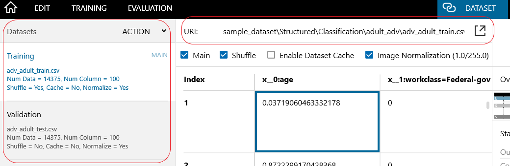
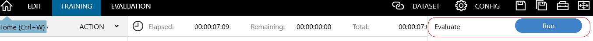

# Adversarial Debiasing (Tabular)

これは `UCI Adult dataset`を用いた`Adversarial Debiasing`におけるバイアス緩和のデモです．

Figure: NNCにおけるAdversarial debiasingの学習ネットワーク図

このデモでは`Adversarial Debiasing`手法を利用して予測モデルのバイアスを緩和する方法を示します．
Adversarial Debiasing は [GANs](https://arxiv.org/abs/1406.2661) (Goodfellow et al. 2014)からアイデアを得ており，GANと同様に下記の２つのネットワークを用います．

1.  ターゲットを変数を学習データから予測する `Classifier` ネットワーク
2.  センシティブ属性を `Classifier` ネットワークの出力から予測する`Adversarial` ネットワーク 

`Classifier` と `Adversarial` ネットワークはお互いの損失最小限にするように交互に学習されます．

NNC で Adversarial Debiasing モデルをトレーニングするには，次の手順に従ってください :

### Step 1 : Neural Network consoleの起動
"neural_network_console.exe"をダブルクリックしてNNCを起動してください．

### Step 2: Adversarial Debiasing projectを開く

`プロジェクトを開く`をクリック，もしくは`Ctrl+O`を押してください．
開かれたウィンドウで`adversarial_debiasing.sdcproj`を選択し，サンプルプロジェクトを開いてください．

Figure: プロジェクトファイルを開く

"Adversarial Debiasing" プロジェクトを初めて開くと，ポップアップウィンドウが開き，Adult datasetのダウンロードを求められます． 
データを自動的にダウンロードして前処理する出力ディレクトリを指定し，`OK`をクリックしてください． 
通常，データセットの準備が完了するまでに数分かかります．

プロジェクトで使用されるadult dataset(`adult.data`)は，[https://archive.ics.uci.edu/ml/datasets/Adult](https://archive.ics.uci.edu/ml/datasets/Adult) からダウンロードされます．

データセットのダウンロードが失敗した場合は，プロキシの問題である可能性があります． NNCのマニュアルを参照してください．

### Step 3: データセット設定

`データセット`タブで，元のadult datasetから抽出された学習データと検証データ(前処理されたadult datasetのサンプル)がロードされていることを確認します．

`adult_data.csv`ファイルを`Training`，`adult_test.csv`ファイルを`Validation`に設定してください.

注 : 
`adult_original_data.csv`と`adult_original_test.csv`ファイルは前処理データセットの作成に使用され，前処理パラメーターは入力CSVファイルに基づいて作成され，`preprocessing_parameters.csv`に保存されます．

Figure: データセット設定

### Step 4:  Adversarial Debiasing  project を表示する
adult datasetで公平な学習を行うために，`編集`タブで"Classifier & Adversarial"ネットワークがロードされていることを確認してください．

### Step 5: adversarial loss のパラメータ lambda (&lambda;) の調整
`Adversarial`ネットワークをクリックし，adverasarial loss パラメータ lambda (&lambda;) (`lambda`, `Adversarial`の最終レイヤー).
`lambda` が 0 の場合, 通常のクラス分類ネットワークとして動作します．
(&lambda;)を調整した後，プロジェクトを保存してください．

Figure: lambda の調整

### Step 6: センシティブ属性の設定
Adversarial ネットワークを学習するには，センシティブ変数データセットからprivileged 変数を指定します．
`Adversarial` ネットワークに移動し，`SensitiveVarible`ノードの`start` と `stop`の値を設定します．
デフォルトでは，人種の "white" が privileged 変数として設定されます．

Figure: センシティブ変数の設定

### Step 7: Adversarial ネットワークを利用して Classfier ネットワークを学習する
`編集`タブで，右側のドロップダウンから `Train`を選択し，`実行`ボンタンを押して学習を開始します．

Figure: 学習の実行

### Step 8: 評価の実行
学習が完了すると，評価の実行ボタンが有効になります．
`学習`タブで`実行`をクリックして検証データセットの評価を開始します．

Figure: 評価の実行

### Step 9: モデルの公平性と精度を確認する
モデルの公平性を確認するには `Fairness` プラグイン を実行します．(`評価`タブで評価結果を右クリックしてショートカットメニューを開き，プラグインを選択します)
すべての公平性プラグインを実行し，敵対的トレーニング前後でのモデルの公平性を確認します．

Figure: Fairness プラグイン

モデルの精度を確認するには`評価`タブへ移動し `Confusion Matrix`クリックしてください．Accuracy, Average Precision, Average Recallなどを確認できます．
この手法の詳細については Google Colab tutorial notebook の([adversarial debiasing](https://colab.research.google.com/github/sony/nnabla-examples/blob/master/interactive-demos/adversarial_debiasing.ipynb)))を確認してください．

# Citation

["Mitigating unwanted biases with adversarial learning." Zhang, Brian Hu, Blake Lemoine, and Margaret Mitchell. In Proceedings of the 2018 AAAI/ACM Conference on AI, Ethics, and Society, pp. 335-340. 2018](https://dl.acm.org/doi/abs/10.1145/3278721.3278779).

# References
1. "Mitigating unwanted biases with adversarial learning." Zhang, Brian Hu, Blake Lemoine, and Margaret Mitchell. In Proceedings of the 2018 AAAI/ACM Conference on AI, Ethics, and Society, pp. 335-340. 2018
2. Fairness-aware classifier with prejudice remover regularizer. Toshihiro Kamishima, Shotaro Akaho, Hideki Asoh & Jun Sakuma. Joint European Conference on Machine Learning and Knowledge Discovery in Databases ECML PKDD 2012: Machine Learning and Knowledge Discovery in Databases pp 35–50.
3. Classification with fairness constraints: A meta-algorithm with provable guarantees. Celis, L. Elisa, Lingxiao Huang, Vijay Keswani, and Nisheeth K. Vishnoi. In Proceedings of the conference on fairness, accountability, and transparency, pp. 319-328. 2019
4. https://archive.ics.uci.edu/ml/datasets/Adult
