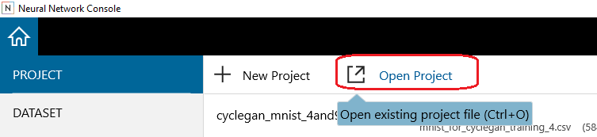
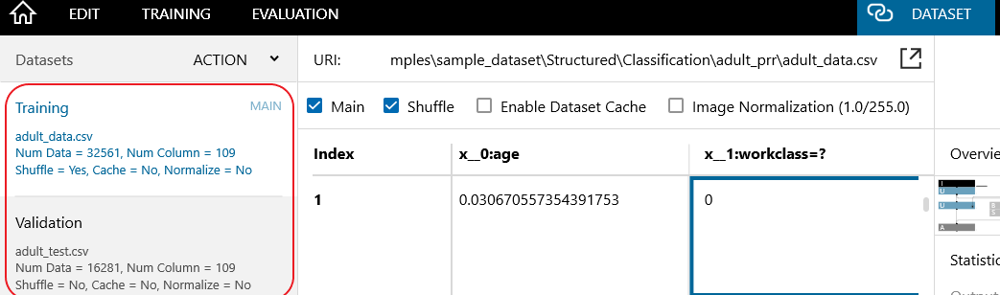
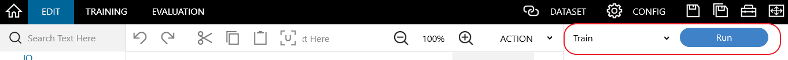

# PRR: Prejudice Remover Regularizer

This is a `Neural Network Console` demo of the `Prejudice Remover Regularizer(PRR)` technique for the Adult dataset.

Figure: NNC training daigram of Prejudice Remover Regularizer

In this demo, we show how to reduce `Indirect Prejudice`, using the `Prejudice Removal Technique`.
In this PRR technique, two types of regularizers are applied: first regularizer is a standard technique to avoid over-fitting: "L2 regularizer" $|θ|^2$.  
Second regularizer is " PR regularizer " $R(D,θ)$ to enforce fair classification. Both are added to the objective function for minimization.

Figure: Objective function of Prejudice Remover Regularizer

To train the PRR model in NNC, please follow the below steps :
### Step 1 : Start Neural Network console
`Double-click` "neural_network_console.exe" to run it.

### Step 2: Open the PRR project

Click `Open Project`, or press `Ctrl+O` on the keyboard. From the list of the (*.sdcproj files), select the `prejudice_remover_regularaizer.sdcproj` and open it.

Figure: Open project file

When the "PRR project" is opened for the first time, it will redirect and open the 'pop-up' window, asking to download the adult data set.  Please provide the ​output​ directory, where you want to download and preprocess the data automatically, and then click `OK`. Typically, it takes a few minutes for dataset preparation to complete.

The adult dataset used in the PRR project is downloaded from the following website(https://archive.ics.uci.edu/ml/datasets/Adult).

If downloading of the dataset fails, it could be proxy issue. Kindly refer to NNC manual. 

### Step 3: Process the Dataset
In the `Dataset` tab, check that adult training and validation datasets(samples of adult
dataset, which is preprocessed), extracted from the full adult dataset have been loaded.

Please assign the `adult_data.csv` file to `Training` set `adult_test.csv` file to `Validation` set.

Note : 
`adult_original_data.csv` & `adult_original_test.csv` files are used to create the pre-processing dataset, and the preprocessing parameter is created based on the input CSV file, which will be saved under the `preprocessing_parameters.csv` file.

Figure: Data configuration

### Step 4: View the contents of the PRR project
In the `EDIT` tab, check that "Classifier & Prejudice_Remover_Regularizer" training network have been loaded, for performing fair classification, on adult dataset.

### Step 5: Tune the eta ($η$) regularization parameter
Go to the `Prejudice_Remover_Regularizer` network, tune the $**η**$(eta, end node of the `Prejudice_Remover_Regularizer` network) regularization parameter. If eta is 0, the network behaves as a simple base class classifier network. After tuning(η) the PRR network, please save the project.

Figure: Tune eta (η)

### Step 6: Train Classfier model with Prejudice Remover Regularizer
In the `Edit` tab, click the `Run` button, to start the training procedure.

Figure: NNC training

### Step 7: Execute evaluation
In the `TRAINING` tab, click the `Run` button to start the evaluation process on the validation dataset.

Figure: NNC Evaluate

### Step 8: Check model fairness
To check the model fairness, execute the `CV Score` postprocessing plugin under `Fairness` plugins(right-click the evaluation results on the evaluation tab to open a shortcut menu and select the plugins). 

* Low CV score values mean a 'fair model' - desirable, while high values mean the model is not fair.
* High accuracy values mean a 'good performance model' - desirable.

To know more about the CV Score plugin, please refer to the CV Score postprocessing plug-in manual.

Figure: Post processing plugin

For more information about this technique, please refer to our google colab tutorial notebook ([link goes here](https://colab.research.google.com/github/sony/nnabla-examples/blob/master/interactive-demos/prejudice_remover_regularizer.ipynb)))

# Citation

**Fairness-aware classifier with prejudice remover regularizer.** Toshihiro Kamishima, Shotaro Akaho, Hideki Asoh & Jun Sakuma.[Joint European Conference on Machine Learning and Knowledge Discovery in Databases ECML PKDD 2012: Machine Learning and Knowledge Discovery in Databases pp 35–50](https://doi.org/10.1007/978-3-642-33486-3_3)

# References
1. Fairness-aware classifier with prejudice remover regularizer. Toshihiro Kamishima, Shotaro Akaho, Hideki Asoh & Jun Sakuma. Joint European Conference on Machine Learning and Knowledge Discovery in Databases ECML PKDD 2012: Machine Learning and Knowledge Discovery in Databases pp 35–50.
2. Classification with fairness constraints: A meta-algorithm with provable guarantees.Celis, L. Elisa, Lingxiao Huang, Vijay Keswani, and Nisheeth K. Vishnoi.In Proceedings of the conference on fairness, accountability, and transparency, pp. 319-328. 2019
3. https://archive.ics.uci.edu/ml/datasets/Adult
