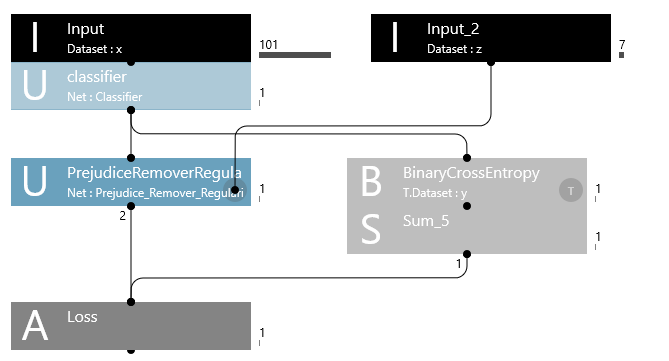
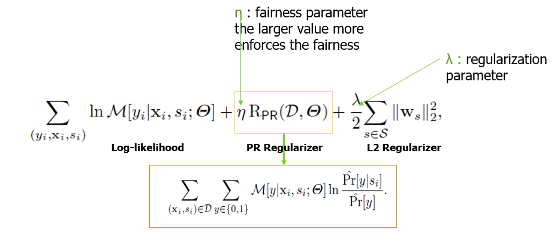
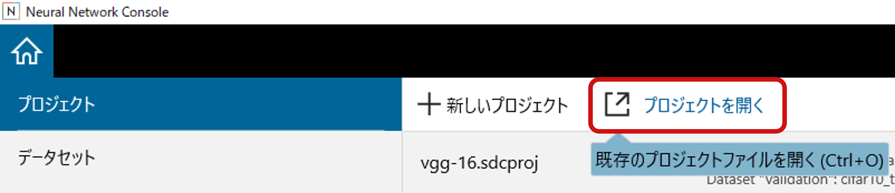
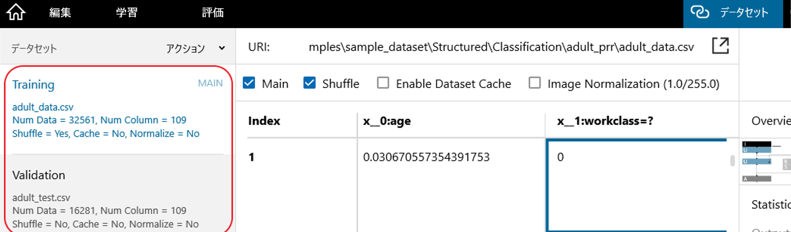
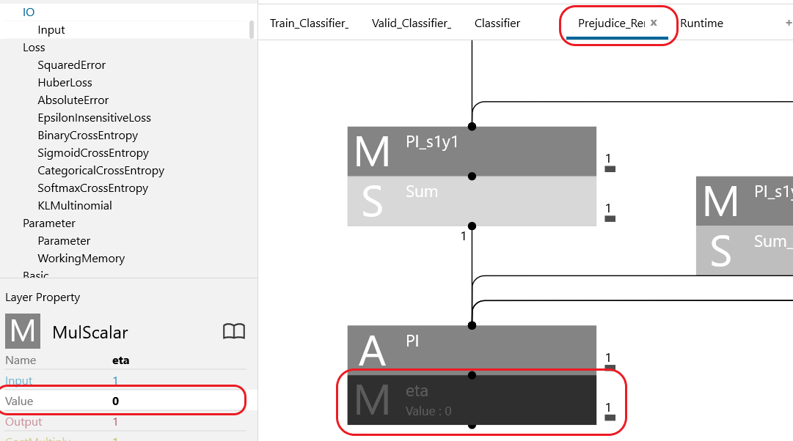
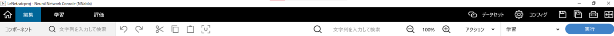
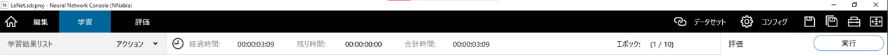
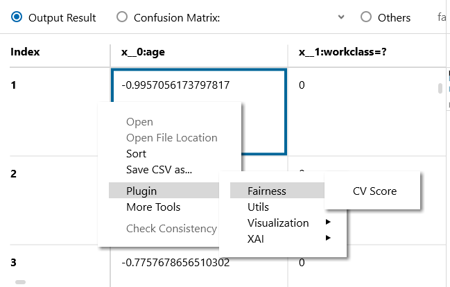

# PRR: Prejudice Remover Regularizer

これはAdult datasetに対して`Prejudice Remover Regularizer(PRR)`を用いた`Neural Network Console`のサンプルファイルです．

Figure: NNCにおけるPrejudice Remover Regularizerのネットワーク図

このデモでは`Prejudice Removal Technique`を利用して意図しないバイアスを軽減する方法を示します．
このPRR手法では，二種類の正則化が適用されます．
1つ目の正則化である"L2正則化" $|θ|^2$は過学習を回避するための一般的な手法です．
2つ目の正則化である"PR正則化" $R(D,θ)$は公正な分類を実施するための手法です．
両方とも目的化関数に追加され学習されます．

Figure: Prejudice Remover Regularizerの目的関数

NNCでPRRを学習する場合は，以下の手順に従ってください．
### Step 1 : Neural Network consoleの起動
"neural_network_console.exe"をダブルクリックしてNNCを起動してください．

### Step 2: PRR projectを開く

`プロジェクトを開く`をクリック，もしくは`Ctrl+O`を押してください．
開かれたウィンドウで`prejudice_remover_regularaizer.sdcproj`を選択し，サンプルプロジェクトを開いてください．

Figure: PRR projectを開く

PRRプロジェクトを初めて開くと，ポップアップウィンドウが開き，Adult datasetのダウンロードを求められます．
データを自動的にダウンロードして前処理する出力ディレクトリを指定し，`OK`をクリックしてください．
通常，データセットの準備が完了するまでに数分かかります．

PRRプロジェクトで使用されるアダルトデータセットは，次のWebサイト(https://archive.ics.uci.edu/ml/datasets/Adult)からダウンロードされます．
データセットのダウンロードが失敗した場合は，プロキシの問題である可能性があります．
NNCのマニュアルを参照してください．

### Step 3: データセット設定
`データセット`タブで，元のadult datasetから抽出された学習データと検証データ(前処理されたadult datasetのサンプル)がロードされていることを確認します．

`adult_data.csv`ファイルを`Training`，`adult_test.csv`ファイルを`Validation`に設定してください.

注 : 
`adult_original_data.csv`と`adult_original_test.csv`ファイルは前処理データセットの作成に使用され，前処理パラメーターは入力CSVファイルに基づいて作成され，`preprocessing_parameters.csv`に保存されます．

Figure: データセット設定

### Step 4: PRRプロジェクトを表示する
adult datasetで公平な学習を行うために，`編集`タブで，"Classifier & Prejudice_Remover_Regularizer"ネットワークがロードされていることを確認してください．

### Step 5: 正則化パラメータ eta ($η$) の調整
`Prejudice_Remover_Regularizer`ネットワークをクリックし，正則化パラメータ$**η**$(eta，`Prejudice_Remover_Regularizer`の最終レイヤー)を調整します．
$**η**$が$0$の場合，ネットワークは正則化されていないクラス分類器ネットワークとして動作します．
PRRの$**η**$を調整した後，プロジェクトを保存してください．

Figure: eta ($η$)の調整

### Step 6: Prejudice Remover Regularizerを用いて分類機の学習
`編集`タブで，`実行`をクリックし学習を開始します．

Figure: NNC学習

### Step 7: 評価の実行
In the `TRAINING` tab, click the `Run` button to start the evaluation process on the validation dataset.
`学習`タブで，`実行`をクリックし検証データセットの評価を開始します．

Figure: NNC評価

### Step 8: モデルの公平性を確認する
モデルの公平性を確認するには， `Fairness`プラグインの下の`CV Score`プラグインを実行します．(`評価`タブで評価結果を右クリックしてショートカットメニューを開き，プラグインを選択します)
* 低いCVスコアは"公正なモデル"を意味します．高いCVスコアはモデルが公正でないことを意味します．
* 高いaccuracyは性能の良いモデルであることを意味します．

CVスコアプラグインの詳細については，CVスコア後処理プラグインのマニュアルを参照してください．

Figure: 後処理プラグイン

この手法の詳細については、[Google colab notebook](https://colab.research.google.com/github/sony/nnabla-examples/blob/master/interactive-demos/prejudice_remover_regularizer.ipynb)を参照してください．

# Citation

**Fairness-aware classifier with prejudice remover regularizer.** Toshihiro Kamishima, Shotaro Akaho, Hideki Asoh & Jun Sakuma.[Joint European Conference on Machine Learning and Knowledge Discovery in Databases ECML PKDD 2012: Machine Learning and Knowledge Discovery in Databases pp 35–50](https://doi.org/10.1007/978-3-642-33486-3_3)

# References
1. Fairness-aware classifier with prejudice remover regularizer. Toshihiro Kamishima, Shotaro Akaho, Hideki Asoh & Jun Sakuma. Joint European Conference on Machine Learning and Knowledge Discovery in Databases ECML PKDD 2012: Machine Learning and Knowledge Discovery in Databases pp 35–50.
2. Classification with fairness constraints: A meta-algorithm with provable guarantees.Celis, L. Elisa, Lingxiao Huang, Vijay Keswani, and Nisheeth K. Vishnoi.In Proceedings of the conference on fairness, accountability, and transparency, pp. 319-328. 2019
3. https://archive.ics.uci.edu/ml/datasets/Adult
